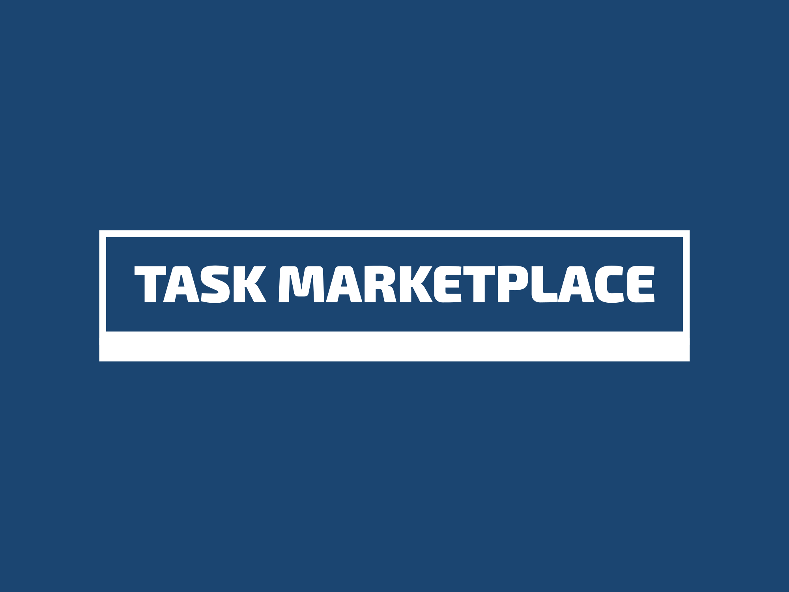

 
### Where you go to get work or get work done.

## Description
Task Marketplace is how we envision the future of work. Enabling a global labour market that can satify the needs of businesses as quick and efficiently as possible. People looking for work whether it be supplementary or for their entire living will find no shortage of tasks to complete.

### The problem we are trying to solve
Work markets are fractured. Fractured by locality. Fractured by funding. Fractured by gatekeepers. 
 
*"A major barrier to a more global job market is the difficulty in routing payments to individuals cross-border. Why not help create a more global and free marketplace for labor, by allowing jobs and tasks to be posted that pay in crypto, and helping employees and contractors find them?"* - [Brian Armstrong](https://www.coinbase.com/blog/request-for-builders-startups-i-would-build-today)

### How we plan to solve it
By building infrastructure on a global ledger that anyone can access, the project seeks to make tasks easy to add, view, fund and update. This will enable:  
- Posting of tasks by anyone
- Viewing, applying to and completing tasks
- Crowdfunding of tasks that are in multiple parties best interest such as open source software projects, or fundraising

#### The tech
Current funding solutions rely on gated payment rails and are needlessly exclusive. They also require filling out payment information in various unsexy ways. This project will enable 2 click donations through a seamless web3 enabled payment experience. We plan to build using Ethereum L2 Base because of its ease of onboarding users from existing traditional permissioned payment rails to the global payment rails provided by Ethereum. We will also consider utilizing fiat onramps such as MoonPay and Sardine but this would not be in a first iteration.

Everything settles onchain. There will be smart contracts that support the creation of tasks and the distribution of funds upon completion of those tasks. This means that every funder, acceptance threshold approver and fund receiver is defined onchain.

# What we need to build (and how you can help)
- [ ] Contracts for "upon completion" payouts
- [ ] Research contracts for managing reputation across platforms and addresses (could we use Base-native ENS names help with this?)
- [ ] Audit smart contracts
- [ ] Design the crowd fund and individual donation iframes (would love help with this as it is not my skill set)
- [ ] Implement iframe designs
- [ ] Backend for sending notifications to users when things happen onchain, other helpful tasks

## Bat Signal 🦇 🔦
- We are looking for someone who wants to help with designing UI for submitting and viewing work. Any help and guidance here would be 🔥
- If they exist, we would love to have someone who is good at Foundry tooling help with writing and testing the contracts